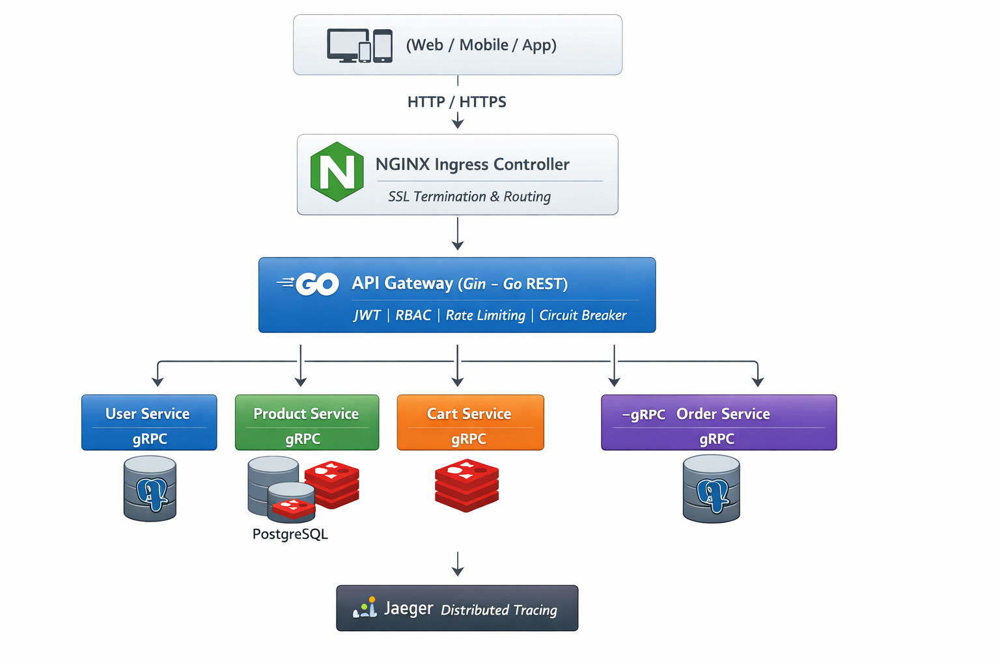

# 🚀 Go Microservices E-Commerce Platform  
### Production-Grade Kubernetes Deployment

<p align="center">
  
  
  
  
  
  
  
</p>

---

## 📌 Overview

This directory contains the complete Kubernetes manifests for a **Production-Ready Go Microservices E-Commerce System** designed using modern cloud-native architectural principles.

This project demonstrates:

- API Gateway Pattern
- gRPC Internal Communication
- Database per Service Pattern
- Redis Caching Strategy
- Horizontal Pod Autoscaling (HPA)
- NGINX Ingress Controller
- Distributed Tracing (Jaeger)
- Infrastructure Separation
- Environment-based Deployment (Kustomize)

---

# 🏗️ System Architecture



---

## 🔄 Request Flow

1. Client sends HTTPS request  
2. NGINX Ingress Controller receives traffic  
3. Traffic routed to API Gateway  
4. Gateway validates JWT & RBAC  
5. Request forwarded via gRPC  
6. Microservice interacts with Database or Redis  
7. Trace exported to Jaeger  
8. Response returned to client  

---

# 🧩 Microservices Layer

All services communicate internally using **gRPC**

| Service        | Communication | Storage |
|---------------|--------------|----------|
| api-gateway   | REST → gRPC  | Stateless |
| user          | gRPC         | PostgreSQL |
| product       | gRPC         | PostgreSQL + Redis (Cache) |
| cart          | gRPC         | Redis |
| order         | gRPC         | PostgreSQL |

---

## 🗄 Infrastructure Layer

### 🔹 Namespace Isolation
All components are deployed within a dedicated Kubernetes namespace.

---

### 🔹 NGINX Ingress Controller
- SSL Termination
- Host-based Routing
- Load Balancing
- Single External Entry Point

Internal services remain private (ClusterIP).

---

### 🔹 PostgreSQL
- Dedicated database per service
- Persistent Volumes (PV)
- Persistent Volume Claims (PVC)
- ClusterIP exposure only

Implements **Database per Service Pattern**

---

### 🔹 Redis
- Product Service: Caching layer (Cache-Aside Pattern)
- Cart Service: In-memory fast operations
- Performance optimization layer

---

### 🔹 Observability – Jaeger
- Distributed Tracing
- End-to-End Request Monitoring
- Latency Analysis
- Debugging Microservices Interactions

---

# 📁 Kubernetes Structure

```
k8s/
├── base/
│   ├── api-gateway/
│   ├── user/
│   ├── product/
│   ├── cart/
│   └── order/
│
├── infr/
│   ├── namespace.yaml
│   ├── ingress.yaml
│   ├── cart-redis/
│   ├── product-redis/
│   ├── users-postgres/
│   ├── products-postgres/
│   └── orders-postgres/
│
└── overlays/
    ├── dev/
    └── prod/
```

---

# 🧩 Application Layer

Each service includes:

- deployment.yaml
- service.yaml
- configmap.yaml
- hpa.yaml
- secret.yaml

---

# ⚙️ Scalability

Each service uses:

- Horizontal Pod Autoscaler (HPA)
- CPU-based scaling
- Stateless microservice design

---

# 🔐 Security

- JWT Authentication (Gateway Level)
- RBAC Authorization
- Rate Limiting
- Circuit Breaker Pattern
- No direct exposure of internal services
- Database isolation per service

---

# 🚀 Deployment

### Deploy Namespace

```
kubectl apply -f infr/namespace.yaml
```

### Deploy Infrastructure

```
kubectl apply -f infr/
```

### Deploy Services

```
kubectl apply -f base/
```

---

# 🔍 Verification

```
kubectl get pods -n <namespace>
kubectl get svc -n <namespace>
kubectl get ingress -n <namespace>
```

---

# 🧠 Architectural Patterns Applied

- Microservices Architecture
- API Gateway Pattern
- Database per Service
- Kubernetes Native Scaling
- Caching Layer Integration
- Infrastructure Separation
- CI/CD Ready Layout

---

# 🛠 Tech Stack

- Go (Gin + gRPC)
- Kubernetes
- Docker
- PostgreSQL
- Redis
- NGINX Ingress Controller
- Kustomize

---

# 📦 CI/CD Ready

```
overlays/
├── dev/
└── prod/
```

# Environment-based configuration planned for:

- Image Tag Injection
- Replica adjustments
- Resource Optimization
- Production hardening
- CI/CD Integration

---

## 👨‍💻 Author

Ahmed Diaa Hassan  
DevOps Engineer | Kubernetes | Cloud | Go Microservices
