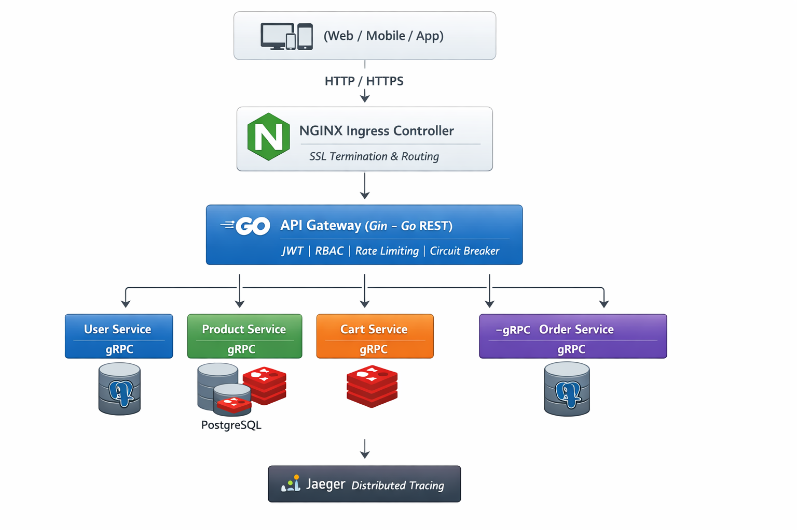

# 🚀 Go Microservices E-Commerce Platform  
## Production-Ready Kubernetes Deployment

<p align="center">
  
  
  
  
  
  
  
</p>

---

## 📌 Overview

This repository contains the Kubernetes infrastructure and deployment configuration for a **Go-based Microservices E-Commerce Platform**, designed using modern cloud-native architectural principles.

The focus of this implementation is on:

- Kubernetes-native deployments  
- Scalable microservices infrastructure  
- Secure networking and service isolation  
- CI/CD-ready architecture  
- Production-ready deployment patterns

---

## 🏗️ System Architecture

This system follows a **Microservices Architecture** where each service is independently deployable and scalable within Kubernetes.



---

## 🔄 Request Flow

1. Client sends HTTPS request  
2. NGINX Ingress Controller receives traffic  
3. Traffic is routed to the API Gateway  
4. Gateway handles authentication and authorization  
5. Request is forwarded internally between services  
6. Service interacts with its database or cache  
7. Response is returned to the client  

---

## 🧩 Microservices Layer

All services communicate internally using **gRPC**

| Service        | Communication | Storage |
|---------------|--------------|----------|
| api-gateway   | REST → gRPC  | Stateless |
| user          | gRPC         | PostgreSQL |
| product       | gRPC         | PostgreSQL + Redis (Cache) |
| cart          | gRPC         | Redis |
| order         | gRPC         | PostgreSQL |

---

## 🗄 Infrastructure Layer

### 🔹 Namespace Isolation
All system components are deployed within a dedicated Kubernetes namespace to ensure environment separation and resource isolation.

---

### 🔹 NGINX Ingress Controller

Provides:

- SSL termination  
- Host-based routing  
- Load balancing  
- Single external entry point  
- Secure access to internal services  

Internal services are exposed using **(ClusterIP)**

---

### 🔹 PostgreSQL

Each service uses its own dedicated database instance following the **Database per Service Pattern**


Features:

- Persistent Volumes (PV)  
- Persistent Volume Claims (PVC)  
- Isolated database instances  
- Internal-only access  
- Reliable data persistence  

---

### 🔹 Redis

Used as a high-performance in-memory data store.


#### Product Service

Implements **Cache-Aside Pattern**

Used for:

- Caching frequently accessed data
- Reducing database load
- Improving response time


#### Cart Service

Used for:

- Fast in-memory operations  
- Session/cart data storage  
- High-speed read/write performance 

---

## 📁 Kubernetes Structure

```
k8s/
├── base/
│   ├── api-gateway/
│   ├── user/
│   ├── product/
│   ├── cart/
│   └── order/
│
├── infr/
│   ├── namespace.yaml
│   ├── ingress.yaml
│   ├── cart-redis/
│   ├── product-redis/
│   ├── users-postgres/
│   ├── products-postgres/
│   └── orders-postgres/
│
└── overlays/
    ├── dev/
    └── prod/
```

---

## 🧩 Application Layer

Each service includes:

- deployment.yaml
- service.yaml
- configmap.yaml
- hpa.yaml
- secret.yaml

---

## ⚙️ Scalability

Each microservice is designed to scale automatically using:

### Horizontal Pod Autoscaler (HPA)

Based on:

- CPU utilization  
- Stateless service design  
- Independent scaling per service  

This enables:

- Dynamic scaling under load  
- Efficient resource utilization  
- High availability  

---

## 🔐 Security

The platform follows secure deployment practices:

- Namespace isolation  
- Internal-only service exposure  
- Database isolation per service  
- Secure ingress routing  
- Kubernetes secrets management  
- Rate limiting and authentication handled at gateway level  

---

## 🚀 Deployment

### Deploy Namespace

```
kubectl apply -f infr/namespace.yaml
```

### Deploy Infrastructure

```
kubectl apply -f infr/
```

### Deploy Services

```
kubectl apply -f base/
```

---

## 🔍 Verification

```
kubectl get pods -n <namespace>
kubectl get svc -n <namespace>
kubectl get ingress -n <namespace>
```

---

## 🧠 Architectural Patterns Applied

- Microservices Architecture
- API Gateway Pattern
- Database per Service Pattern
- Kubernetes Native Scaling
- Caching Layer Integration
- Infrastructure Separation
- Environment-based Deployment
- CI/CD Ready Architecture

---

## 🛠 Tech Stack

- Go (Backend Services)
- Kubernetes
- Docker
- PostgreSQL
- Redis
- NGINX Ingress Controller
- Kustomize
- GitHub Actions (CI/CD)
- Trivy (Container Security Scanning)

---

## 📊 Monitoring (Planned)

The system is designed to support production-grade monitoring using **Prometheus + Grafana**

Planned capabilities:

Metrics collection
Service health monitoring
Resource usage visualization
Alerting and incident detection
Performance analysis


---

## 📦 CI/CD Ready

The repository is structured to support automated deployments using CI/CD pipelines.

```
overlays/
├── dev/
└── prod/
```

Planned CI/CD capabilities:

Docker image build and push
Security scanning using Trivy
Image tag injection
Environment-based deployment
Helm-based deployment (Next Phase)

---

## 👨‍💻 My Contribution

Designed and implemented the Kubernetes infrastructure and deployment configuration for the microservices platform,including:

Kubernetes namespace and resource management
NGINX Ingress configuration
Redis and PostgreSQL deployments
Horizontal Pod Autoscaler (HPA) setup
Environment separation using Kustomize
CI/CD pipeline with Docker image automation
Container security scanning using Trivy
Preparation for Helm-based deployment

---

## 👨‍💻 Author

Ahmed Diaa Hassan  
DevOps Engineer
Kubernetes | Docker | CI/CD | Cloud | Infrastructure | DevOps

---

**Next milestone:**
- Helm deployment
- Prometheus + Grafana monitoring
